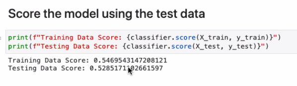
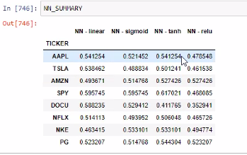
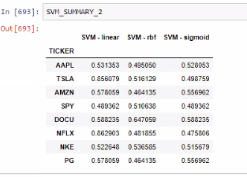
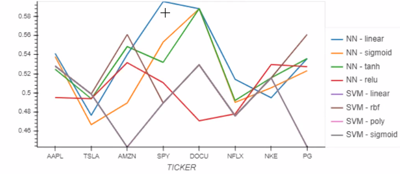
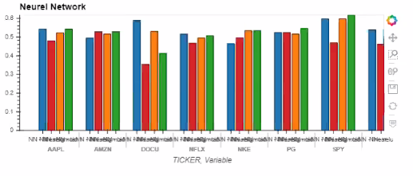

# Group1_Project2
# Stock Prediction Tool
With this project we sought to evaluate the efficiency of models built using Natural Language Processing. 

We opted to use NLP to evaluate financial headlines, and attempted to model market performance based on their calculated sentiment score.

**Dependencies/Import information is located at the bottom of this guide.**

# I. Summary of Findings

We determined that using Natural Language Processing - specifically sentiment of financial articless to analyze stock movement/make predictions of stock movement did generate a good model, indicating a trading strategy based on the analysis could be successful.

We found our Neural Net Model to be most efficient, based on accuracy scores.

## **Logistic Regression**

## **Neural Network Model** 

## **Support Vector Machines**

## **SVM vs. NN Accuracy Visualized**

## **NN Accuracy Visualized**

# II. Questions Answered
1. Can you use NLP to create a valid trading model?
> Yes
2. Is news sentiment a good indicator to use for trading
> Likely. More work is needed, but our model accuracy was high enough to suggest it's worth exploring.

# III. Questions Left to Answer
1. What makes the model more efficient?
> Would using 'tokens' or 'entities' to analyze headlines lead to a more efficient model?
> Could other trading strategies be developed using 'tokens' or 'entities'?
2. What would make the model more accurate?
> Would adding additional analysis EX: Click rates, number of views, etc. make the model more accurate?

# IV. Next Steps
To thoroughly examine our idea, we would need to do the following:

1. Backtesting
2. Creating a trading algorithm

# V. Notebooks Demonstrated in Presentation
1. Sentiment - Copy.ipynb
    >Contains the Webscraper/Sentiment Analysis
2. NLP-VADER.ipynb
    >Contains the functions that tokenize headlines, find top tokens, and perform NER.
3. Lexalytics
    > [Lexalytics](https://www.lexalytics.com/)
3.  ML Models (Folder) > Logistic Regression Models (Folder)> LRModel.ipynb
    >Contains the Logistic Regression Model
4. Sentiment-Copy1
    >Contains the Nueral Network and Support Vector Machines models

# VI. Dependencies
 ### *Web Scraping Code*
 
* #!pip install bs4
* #!pip install selenium
* from selenium import webdriver
* from selenium.webdriver.common.by import By
* from selenium.webdriver.support.ui import 
    * WebDriverWait
* from selenium.webdriver.support import 
    * expected_conditions as EC
* from selenium.webdriver.common.action_chains import ActionChains
* from bs4 import BeautifulSoup
* import requests
* import pandas as pd
* import numpy as np
* from pathlib import Path

### *AAPL_WEB_SCRAPING_CODE*
* from splinter import Browser
* import pandas as pd
* import numpy as np

### *NLP-VADER*
##### Tokens
* from dotenv import load_dotenv
* import nltk
    * nltk.download('vader_lexicon')
* from nltk.sentiment.vader import SentimentIntensityAnalyzer
* from vaderSentiment import SentimentIntensityAnalyzer
* from pathlib import Path
* analyzer = SentimentIntensityAnalyzer()

##### Most Frequent Tokens
* from collections import Counter

##### WordClouds
* from wordcloud import WordCloud
* import matplotlib.pyplot as plt
* plt.style.use('seaborn-whitegrid')
* import matplotlib as mpl
* mpl.rcParams['figure.figsize'] = [20.0, 10.0]

##### NER
* import spacy
* from spacy import displacy

### LRModel
* import os
* from pathlib import Path
* import pandas as pd
* import numpy as np
* import matplotlib.pyplot as plt
* from datetime import datetime, timedelta
* from dotenv import load_dotenv
* import alpaca_trade_api as tradeapi
* import nltk
* from nltk.sentiment.vader import SentimentIntensityAnalyzer
* import tensorflow as tf
* get_ipython().run_line_magic("matplotlib", "inline")
* %matplotlib inline

### Sentiment-Copy1
* import os
* from pathlib import Path
* import pandas as pd
* from datetime import datetime, timedelta
* from dotenv import load_dotenv
* import alpaca_trade_api as tradeapi
* import numpy as np

* from selenium import webdriver
* from splinter import Browser

* import nltk
* from nltk.sentiment.vader import SentimentIntensityAnalyzer

* get_ipython().run_line_magic("matplotlib", "inline")